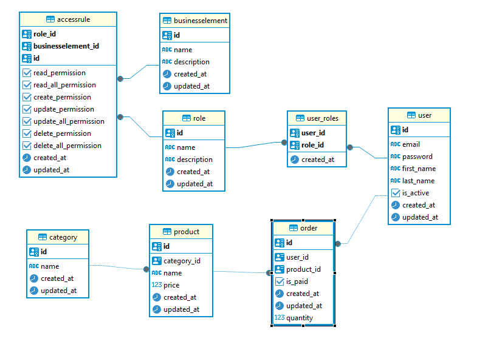

**тестовое задание**

 - **локально   [тестовое задание](TASK.md)**
 - **на гитхубе [тестовое задание](https://github.com/stds58/efektivemobile/blob/master/TASK.md)**

**развёртывание**

клонируйте репозиторий
https://github.com/stds58/efektivemobile.git

создайте .env из .env.example со своими значениями

создайте docker контейнер с БД и запустите его

    docker-compose up --build

Данные из [sample_data.py](app/utils/sample_data.py) импортируются автоматически 
при инициализации приложения, при условии, что таблицы пусты или 
требуемые сущности ещё не существуют.

данные протестировать можно в свагере http://127.0.0.1:8000/api/docs

**схема управления ограничениями доступа:**

    В проекте реализована гибкая система управления доступом 
    на основе RBAC с поддержкой детализированных разрешений 
    на уровне бизнес-сущностей

    User 
        Пользователь системы. Имеет уникальный email, пароль, 
        флаг активности и может обладать несколькими ролями.
    Role 
        Роль — логическая группировка прав (например:admin,manager,user). 
        Роли назначаются пользователям.
    BusinessElement 
        Бизнес-сущность, к которой применяются права доступа 
        (например:user,product,order,category,access_rule,user_roles).
    AccessRule 
        Связь между ролью и бизнес-сущностью. 
        Определяет, какие операции разрешены для данной роли над данной сущностью.
    Permission 
        Конкретное право на действие:
        read,read_all,create,update,update_all,delete,delete_all.

    Для каждой бизнес-сущности поддерживаются следующие типы разрешений: 

        read_permission — просмотр своих записей.
        read_all_permission — просмотр всех записей (включая чужие).
        create_permission — создание своей новой записи.
        update_permission — редактирование своих записей.
        update_all_permission — редактирование всех записей (включая чужие).
        delete_permission — удаление своих записей.
        delete_all_permission — удаление всех записей (включая чужие).
     

Как работает проверка доступа 

    При каждом запросе к защищённому эндпоинту: 
        извлекается JWT-токен
        определяется текущий пользователь
        собираются все его роли (сейчас из БД, но правильней из JWT-токена)
        для каждой роли загружаются связанные правила
        агрегируются все разрешения по целевой бизнес-сущности (например, order)
         

    Сервисный слой (app/services/) проверяет, достаточно ли у пользователя прав для выполнения операции: 
        для чтения — наличие read_permission или read_all_permission;
        для создания — create_permission;
        для редактирования — update_permission (если ресурс принадлежит пользователю) или update_all_permission
        аналогично для удаления

    Если права отсутствуют — выбрасывается исключение PermissionDenied

Система реализует двухуровневую защиту сессий пользователей:

    Динамическая ротация ключей подписи
        При каждом перезапуске приложения генерируется новый SECRET_KEY
        Все ранее выданные JWT-токены автоматически становятся невалидными
        Гарантирует принудительное завершение всех активных сессий

    Распределенный черный список токенов
        In-memory кэш служит реестром отозванных токенов
        Время жизни записей соответствует сроку действия access-токенов
        Обеспечивает мгновенный logout до естественного истечения срока токена

    Токены
        при авторизации выдаётся короткоживущий access token и долгоживущий refresh token

    Свагер
        для удобства тестирования, при авторизации в свагере через Authorize фастапи сам запоминает access token
     

**схема БД**

